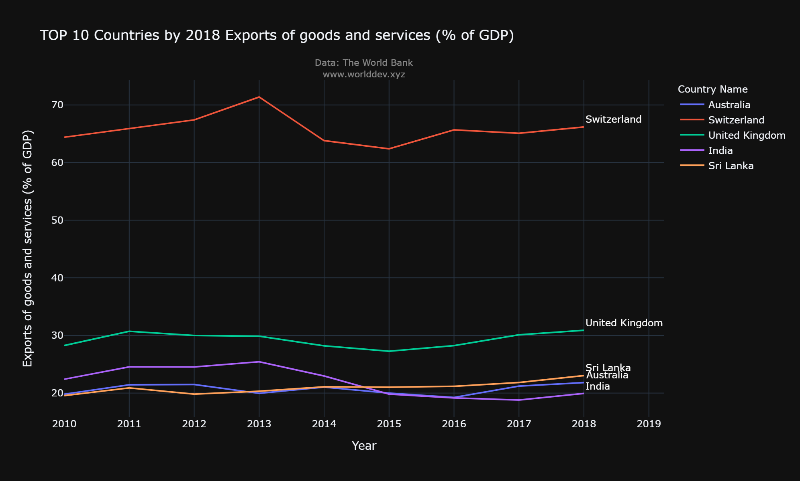
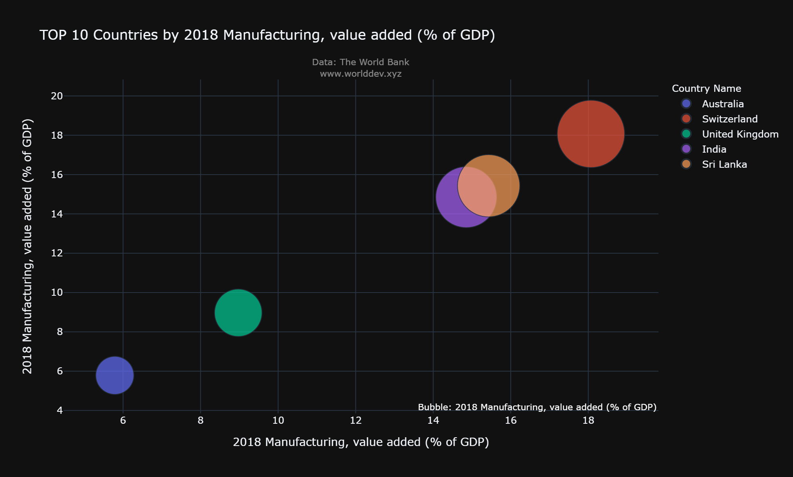
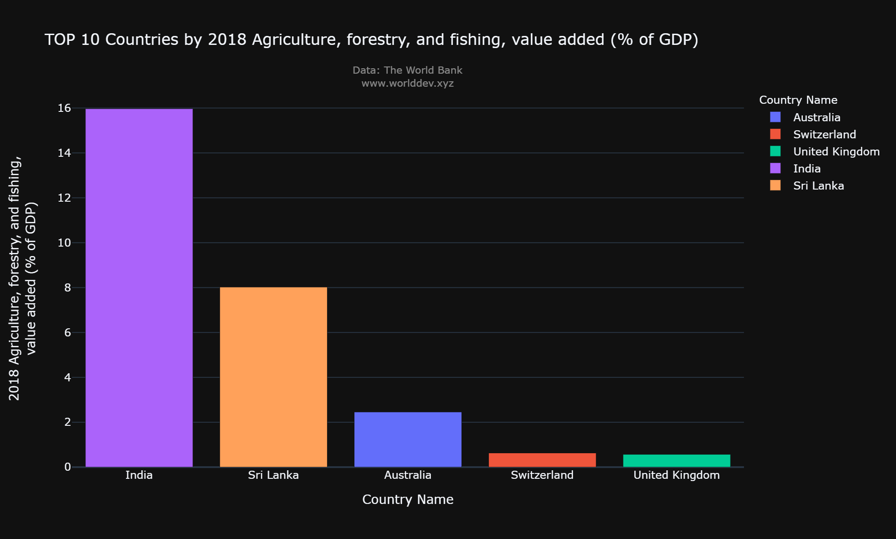
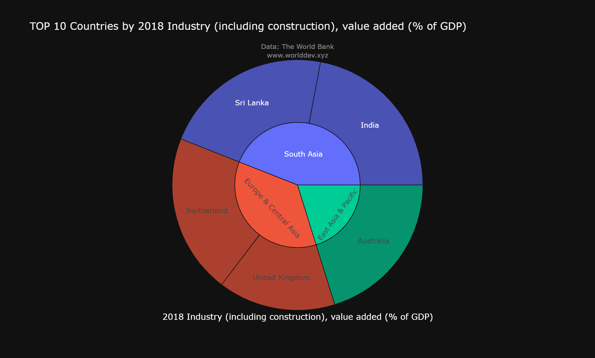
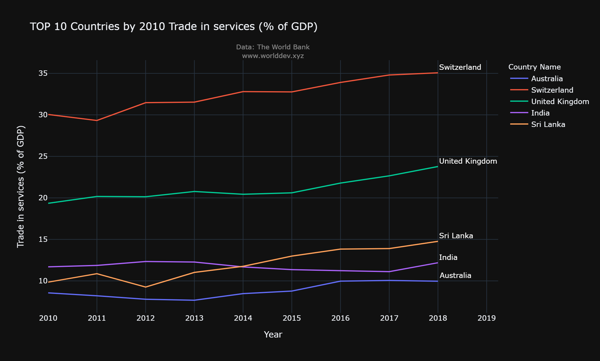

# Topic:
- Economy and Growth
# Indicators:
- Exports of goods and services (% of GDP)
- Manufacturing, value added (% of GDP)
- Industry (including construction), value added (% of GDP)
- Trade in services (% of GDP)
- Agriculture, forestry, and fishing, value added (% of GDP)
- GDP per capita, PPP (current international $)
# Countries compared:
- India
- United Kingdom
- Australia
- Switzerland
- Sri Lanka
# Introduction:
- Economic growth is an increase in the production of goods and services in an economy. Economic growth is commonly measured in terms of the increase in aggregated market value of   additional goods and services produced, using estimates such as GDP.
# Goods and Service Sector contribution to Economy growth:
 
# Manufacturing Sector contribution to Economy growth:
 
# Agriculture Sector contribution to Economy growth:
 
# Industrial Sector contribution to Economy growth:
 
# Service Sector contribution to Economy growth:
 

